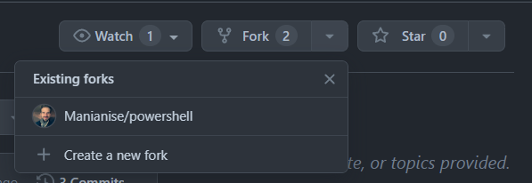
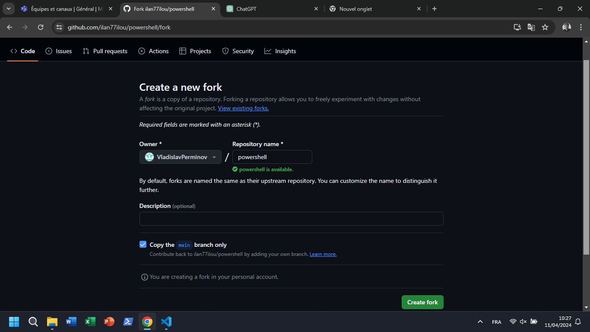
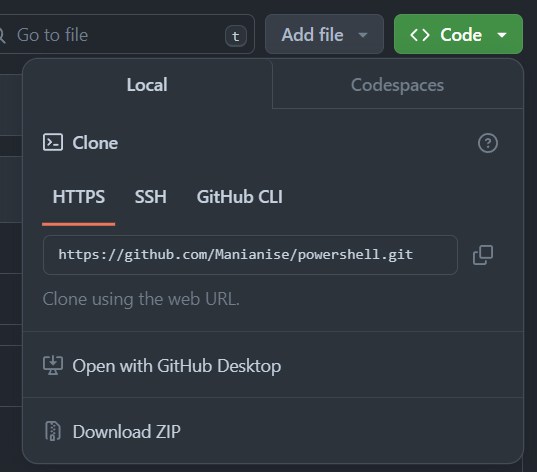
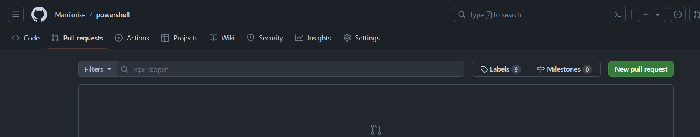

# powershell

# Instructions :

il faut aller dans l'onglet fork, create new fork :

puis create fork :

Vous allez être redirigés vers votre dossier que vous venez de fork. En gros, vous avez cloné le projet directement sur votre github en ligne.
Vous allez pouvoir maintenant cloner votre fork :

- Passons aux lignes de commande

git clone https://github.com/Manianise/powershell.git

- add le remote repository de Ilan :

 git remote add upstream https://github.com/ilan77ilou/powershell.git

- vérifier que ca a marché :

git remote -v

Enfin, après avoir fait vos changements, vous faites un pull request

