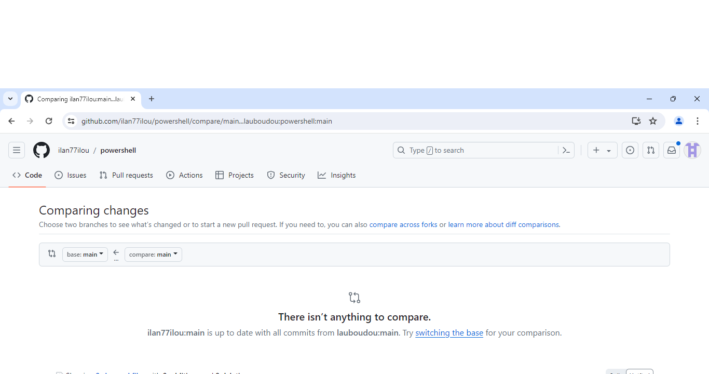
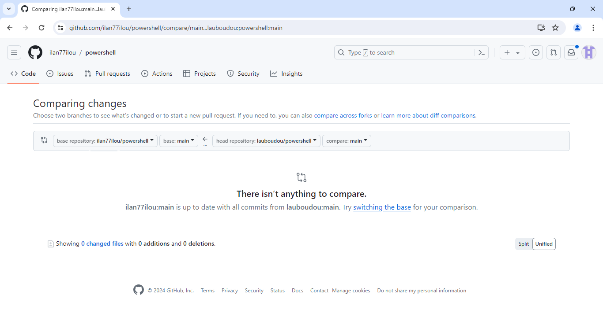

# powershell

# Instructions :

il faut aller dans l'onglet fork, create new fork :

puis create fork :

Vous allez être redirigés vers votre dossier que vous venez de fork. En gros, vous avez cloné le projet directement sur votre github en ligne.
Vous allez pouvoir maintenant cloner votre fork :

- Passons aux lignes de commande

git clone https://github.com/NOM_DE_VOTRE_DOSSIER/powershell.git

- add le remote repository de Ilan :

 git remote add upstream https://github.com/ilan77ilou/powershell.git

- vérifier que ca a marché :

git remote -v

Enfin, après avoir fait vos changements, vous faites un pull request

Aller dans le menu Pull Requests

Cliquer sur New Pull Request

Dans la nouvelle fenêtre préciser les repositories à comparer 

Vérifier les modifications à envoyer en pull (si il y'en a) et créer le full request qui sera validé le repository en question.

